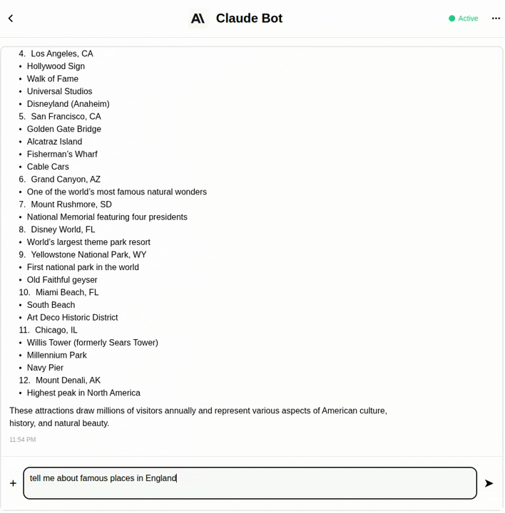

# Claude Bot

## Table of Contents
- [What you'll get](#what-youll-get)
- [How to build it](#how-to-build-it)
- [Deployed](#deployed)
- [Support](#support)

## What you'll get

### Description
A simple yet powerful AI assistant powered by Anthropic's Claude, offering intelligent conversations and helpful assistance across a wide range of topics. Perfect for quick questions, brainstorming, writing help, and coding assistance.

### Live bot



🔗 **Try it now:** [Claude Bot on BubbleTea](https://bubbletea.chat/bot/claude-bot)

**Example Chat:** [View a sample conversation](https://bubbletea.chat/shared/fnG3Nih-JsdZDbjf9Fg30nJ2Gei0K4DI83yUjrFydNE)

### Features
- **Natural Language Conversations** - Powered by Claude 3.5 Sonnet for intelligent responses
- **Quick Responses** - Direct integration with Anthropic API for fast replies
- **Rich Markdown Support** - Formatted responses with markdown rendering
- **Multi-turn Dialog** - Great for brainstorming and extended conversations
- **Code Assistance** - Help with programming questions and debugging
- **Creative Writing** - Support for content generation and editing
- **Simple Setup** - Minimal configuration required
- **Error Handling** - Graceful fallbacks for API issues

## How to build it

### Code review

1. **Main Components:**
   - `claude_assistant()` - Main chatbot handler decorated with @bt.chatbot
   - `get_config()` - Bot configuration with metadata and display settings
   - Direct Anthropic client integration for simplicity

2. **Key Technologies:**
   - BubbleTea Chat SDK for bot framework
   - Anthropic Python SDK for Claude API
   - Environment variables for secure API key management
   - Markdown component for rich text responses

3. **Architecture Flow:**
   - User sends message → Bot receives via webhook
   - Message sent directly to Claude API
   - Response formatted as Markdown component
   - Returned immediately to user (no async needed)

4. **Environment Variables:**
   ```
   ANTHROPIC_API_KEY=your_anthropic_api_key
   BOT_URL=your_bot_url (optional)
   ```

### Deployment

1. **Prerequisites:**
   - Python 3.8+
   - Google Cloud Platform account
   - Anthropic API key

2. **Installation:**
   ```bash
   pip install -r requirements.txt
   ```

3. **Local Testing:**
   ```bash
   # Set environment variable
   export ANTHROPIC_API_KEY="your_key"

   # Run the bot
   python bot.py
   ```

4. **Configuration:**
   - Set ANTHROPIC_API_KEY environment variable
   - Bot runs on port 8080 by default
   - Update webhook URL in BubbleTea dashboard

## Deployed

✅ **Status:** Successfully deployed on Google Cloud Run

🌐 **Platform:** Google Cloud Platform (GCP)

📍 **Region:** Configurable (default: us-central1)

🔗 **Live URL:** Available on [BubbleTea Chat](https://bubbletea.chat/bot/claude-simple)

🚀 **Port:** 8080 (Cloud Run default)

## Support
For Anthropic API documentation, visit [docs.anthropic.com](https://docs.anthropic.com)
For BubbleTea platform issues: [github.com/bubbletea-chat/bubbletea](https://github.com/bubbletea-chat/bubbletea)