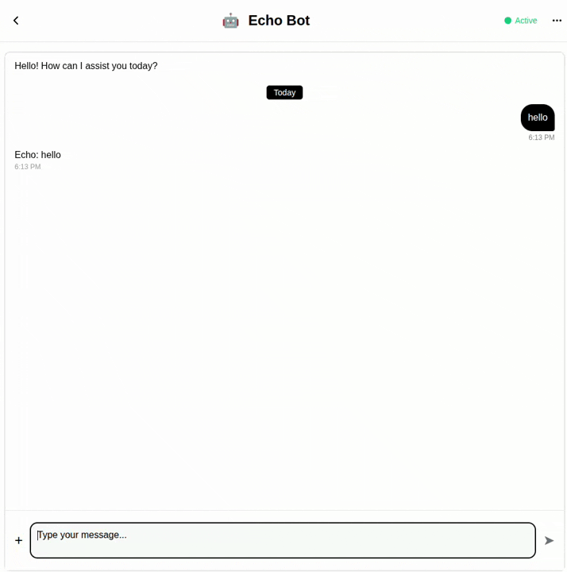

# Echo Bot

## What you'll get

### Description
A simple demonstration bot that echoes back whatever you type. Perfect for testing BubbleTea integration, learning bot development basics, and serving as a minimal template for building more complex bots.

### Live bot



🔗 **Try it now:** [Echo Bot on BubbleTea](https://bubbletea.chat/bot/echo-bot)

### Example conversations
- "Hello" → "Echo: Hello"
- "How are you?" → "Echo: How are you?"
- "Test message 123" → "Echo: Test message 123"
- "🎉 Party time!" → "Echo: 🎉 Party time!"

### Features
- **Instant Echo** - Returns your message immediately with "Echo: " prefix
- **Simple Implementation** - Minimal code for easy understanding
- **No External APIs** - Works standalone without any API keys
- **Lightweight** - Minimal dependencies (just BubbleTea SDK)
- **Stateless Operation** - No message history or context needed
- **Perfect Template** - Great starting point for bot development
- **Error-Free** - Simple logic means reliable operation
- **Fast Response** - No processing delay

## How to build it

### Code review

1. **Main Components:**
   - `echo_bot()` - Main handler that echoes the message
   - `get_config()` - Bot configuration and metadata
   - Simple one-line echo logic

2. **Key Technologies:**
   - BubbleTea Chat SDK for bot framework
   - Python with minimal dependencies
   - No external services required

3. **Architecture Flow:**
   - User sends message → Bot receives via webhook
   - Adds "Echo: " prefix to message
   - Returns formatted response immediately
   - No state management needed

4. **Environment Variables:**
   ```
   # No API keys required!
   # Optional: BOT_URL for custom deployment
   ```

### Deployment

1. **Prerequisites:**
   - Python 3.8+
   - pip package manager

2. **Installation:**
   ```bash
   pip install -r requirements.txt
   ```

3. **Local Testing:**
   ```bash
   # No environment variables needed
   python bot.py
   ```

4. **Configuration:**
   - No environment variables required
   - Bot runs on port 8080 by default
   - Ready to use immediately

## Deployed

✅ **Status:** Successfully deployed on Google Cloud Run

🌐 **Platform:** Google Cloud Platform (GCP)

📍 **Region:** us-east1

🔗 **Live URL:** Available on [BubbleTea Chat](https://bubbletea.chat/bot/echo-bot)

🚀 **Port:** 8080

## Support
For BubbleTea SDK documentation: [docs.bubbletea.chat](https://bubbletea.chat/docs)
For platform issues: [github.com/bubbletea-chat/bubbletea](https://github.com/bubbletea-chat/bubbletea)